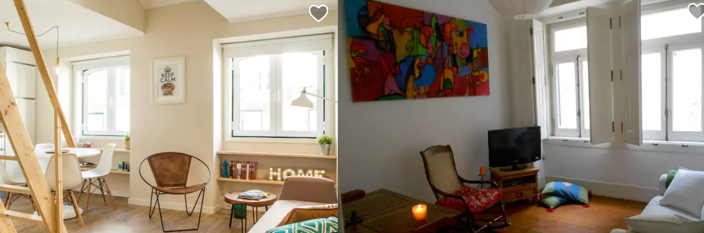
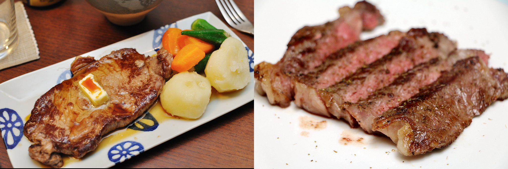
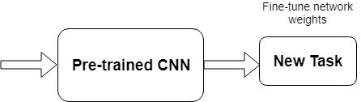
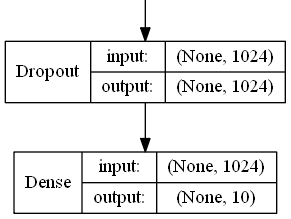
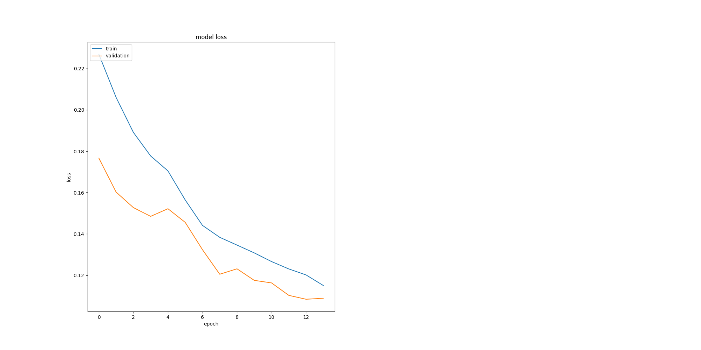

```{r setup, include=F}

options(Encoding="UTF-8")
knitr::opts_chunk$set(echo = F, warning=F, message=F, 
    fig.align ='left', fig.pos = 'H')
```


```{r}
library(knitr)
library(tidyverse)
library(imager)
library(glue)
library(ggthemes)
library(scales)
library(radiant.data)
library(corrplot)
library(gridExtra)
library(summarytools)
```

```{r}
set.seed(43)
DATASET.PATH <-  './data/ava_downloader/AVA_dataset'
MODELS.PATH <- './models/'
```

```{r}

show.images <-  function(n, df, ncols=4){
   layout(matrix(1:n,ncol=ncols,byr=T))

   for(i in seq(1,n,1)){
    image.id <- df$image.id[i]
    plot(load.image(glue("{DATASET.PATH}/images/{image.id}.jpg")))
   }
}
```


```{r}
df <- read_csv(glue("{DATASET.PATH}/images_meta.csv")) %>% 
  select(image.id, `1`, `2`, `3`, `4`, `5`, `6`, `7`, `8`, `9`, `10`, 
         rating.mean, rating.sd) %>% drop_na() %>% mutate(image.id=as.integer(image.id), rating.mean.bucket=cut(rating.mean, breaks=c(1,2,3,4,5,6,7,8,9,10), labels=c('1-2', '2-3', '3-4', '4-5', '5-6', '6-7', '7-8','8-9', '9-10'))) 
```


```{r}
num.ratings.df <-  df %>% 
  select(-rating.mean, -rating.sd, -rating.mean.bucket)  %>% 
  gather(-image.id, key = 'rating', value = 'number') %>%
  mutate(rating=as.numeric(rating)) %>% group_by(image.id) %>% 
  summarize(number=sum(number), na.rm=T)
```


```{r}
plot.dist.num.ratings <- num.ratings.df %>%
  ggplot() +
  geom_histogram(aes(number), fill='steelblue', bins=50) +
  labs(title="",
        y ="Number Of Images", x = "Number Of Ratings")

plot.dist.rating.mean <- df %>%
  ggplot() +
  geom_histogram(aes(x=rating.mean), fill='steelblue', bins=50) +
  scale_x_continuous(breaks=seq(0,10,0.5))+
  labs(title="",
        y ="Number Of Images", x = "Rating Mean")+
  coord_flip()

plot.boxplot.rating.mean <- df %>%
  ggplot() +
  geom_boxplot(aes(y=rating.mean, x='')) +
  scale_y_continuous(breaks=seq(0,10,0.5))+
  labs(title="",
        x ="", y = "Rating Mean") 
plot.dist.rating.sd <- df %>%
  ggplot() +
  geom_histogram(aes(x=rating.sd), fill='steelblue', bins=50) +
  scale_x_continuous(breaks=seq(0,10,0.5))+
  labs(title="",
        y ="Number Of Images", x = "Standard Deviation Of Rating")+
  coord_flip()
plot.boxplot.rating.sd1 <- df %>%
  ggplot() +
  geom_boxplot(aes(y=rating.sd, x='')) +
  scale_y_continuous(breaks=seq(0,10,0.5))+
  labs(title="",
        x =" ", y = "Standard Deviation Of Rating") 

plot.boxplot.rating.sd2 <- df %>%
  ggplot(aes(y=rating.sd, x=rating.mean.bucket)) +
  geom_jitter(color='steelblue', alpha=0.4) +
  geom_boxplot(alpha=.7) +
  scale_y_continuous(breaks=seq(0,10,0.5))+
  labs(title="Distribution of Standard deviation in Rating Bins",
        x ="Rating Bin", y = "Standard Deviation Of Rating") 
```

```{r}
dir.names <- dir(MODELS.PATH)
all.scores = NA
for(i in 1:length(dir.names)){
  model = dir.names[i]
  files.names <- dir(glue("{MODELS.PATH}/{model}"), pattern='test_scores.csv')
  
  for(j in 1:length(files.names)){
    score.file <- files.names[j]
    scores <- read_csv(glue("{MODELS.PATH}/{model}/{score.file}")) %>% select(-X1)
    scores$model = model
    if(is.na(all.scores)){
      all.scores = scores
    } else {
      all.scores <- rbind(all.scores, scores)
    }
  }
    
   
  
}

models_df <- read_csv('resources/model_params.csv') %>%   inner_join(all.scores, by='model')

best_model <- models_df %>% arrange(emd) %>% head(1)
best_model_name <- best_model$model
best_model_acc <- best_model$acc
best_model_emd <- best_model$emd
best_model_dropout <- best_model$dropout
best_model_lr_dense <- best_model$lrdense
best_model_lr_all <- best_model$lrall
best_model_lr_decay_dense <- best_model$lrdecaydense
best_model_lr_decay_all <- best_model$lrdecayall
best_model_epochs_dense <- best_model$epochsdense
best_model_epochs_all <- best_model$epochsall

```


```{r}
train_df <- read_csv(glue('{MODELS.PATH}/{best_model_name}/train_data.csv')) %>% select(image.id, rating.mean)

num.samples.train.set <- dim(train_df)[1]
best_model$nsamples <- num.samples.train.set

test.df <- read_csv(glue('{MODELS.PATH}/{best_model_name}/test_data.csv')) %>% select(image.id, rating.mean)


test.df <- read_csv(glue('{MODELS.PATH}/{best_model_name}/test_prediction_data.csv')) %>% merge(test.df, by='row.names') %>%              
                                                                  mutate(predicted.mean=(`1_pred`+ 2 * `2_pred`
                                                                                    + 3 * `3_pred`
                                                                                    + 4 * `4_pred`
                                                                                    + 5 * `5_pred`
                                                                                    + 6 * `6_pred`
                                                                                    + 7 * `7_pred`
                                                                                    + 8 * `8_pred`
                                                                                    + 9 * `9_pred`
                                                                                    + 10 * `10_pred`
                                                                                    )) %>% 
  mutate(rating.bucket.bin = cut(rating.mean, c(0,5,10), labels=c('low','high')),
         predicted.rating.bucket.bin = cut(predicted.mean, c(0,5,10), labels=c('low','high'))
         )
```


```{r}
ground_truth_plot <- test.df %>%   ggplot() +
  geom_histogram(aes(x=rating.mean, fill='Ground Truth'),   binwidth = 0.05, alpha=0.9) +
  geom_histogram(aes(x=predicted.mean,fill='Predicted'),  binwidth = 0.05, alpha=0.5) +
  scale_fill_manual("", values=c("steelblue", "darkred")) +
  scale_x_continuous(breaks=seq(0,10,0.5))  +
  labs(x='Mean Rating', x='Number Of Images')
```

```{r}
ground_truth_plot_low <- ground_truth_plot + scale_x_continuous(limits=c(1,4))
```

```{r}
ground_truth_plot_high<- ground_truth_plot + scale_x_continuous(limits=c(6.5,9))
```


## I. Definition

### Project Overview

The "A picture is worth a thousand words" stresses how important images are in the 
modern world. The quality of images e.g. influences our decisions in different domains. 
Especially in eCommerce, where we cannot touch things they are very important. 
They have therefore a big influence on our product purchasing decisions.

```{r, out.width = "50%", fig.cap='Which room to book?'}

```
```{r, out.width = "50%", fig.cap='Which guy to date?'}

```
```{r ,out.width = "50%", fig.cap='Which food to order?'}

```


The goal of this project is to create a model that is able to quantify the aesthetics of images.


### Problem Statement

The quantification of image quality is an old problem in computer vision. There are objective and 
subjective methods to assess image quality. With objective methods different algorithms quantify the distortions and degradations in an image.
Subjective methods are based on human perception. The methods often dont't correlate with each other. Objective methods involve traditional
rule-based programming, Subjective methods are not solvable this way. 

The goal of this project is to develop an subjective method of image quality assessment. As mentioned before this problem cannot be solved with classical programming. But it seems that supervised machine learning is a perfect candidate for solving the problem  as this approach learns from examples and it is a way to quantify the ineffeble. A dataset with image quality annotations is a requirement for learning from samples.

Within the machine learning ecosystem Convolutional Neural Networks (CNN) are a category of Neural Networks that have proven very effective in areas such as image recognition and classification. 
They are inspired by biological processes in that the connectivity pattern between neurons resembles the organization of the human visual cortex. 

The subjective quality model will be implemented with a Convolutional Neural Network as it seems a good fit to tackle the problem.

To solve the problem these steps are needed:

1. Find a dataset with images with quality annotations 
2. Exploratory Data Analysis (EDA) on the dataset, to evaluate the characteristics and suitabilty for the problem space
3. Cleanup and preprocessing of the dataset
4. Design a architecture for the CNN
5. Training of the CNN
6. Test the model against benchmarks
7. Analysis of the results

There will be several iterations for the steps 4.-7.


### Metrics

The distribution of user ratings will be predicted in the project. From there you are able to predict both a quantitative mean rating, but also
a qualitive rating bucket. To capture this two metrics will be used.

#### Earth Mover's distance (EMD)

The __Earth Mover's Distance (EMD)__ is a method to evaluate dissimilarity between two multi-dimensional distributions 
in some feature space where a distance measure between single features, which we call the ground distance is given. 
The EMD 'lifts' this distance from individual features to full distributions.
It's assumed that a well performing CNN should predict class
distributions such that classes closer to the ground truth
class should have higher predicted probabilities than classes
that are further away. For the  image quality ratings, the scores 4, 5, and 6 are more related than 1, 5, and 10, i.e. the goal is to 
punish a prediction of 4 more if the true score is 10 than when the true score is 5. The EMD is defined as the minimum
cost to transport the mass of one distribution (histogram)
to the other. [@hou2016squared][@rubner2000earth][@talebi2018nima]

$$EMD(P,Q) = \dfrac{\sum\limits_{i=1}^m \sum\limits_{j=1}^n f_{ij} d_{ij}}{\sum\limits_{i=1}^m\sum\limits_{j=1}^n f_{ij}}$$

#### Accuracy

To compare qualitative results  the __Accuracy__ is used.
The accuracy is the ratio of correct predictions. In this case the ground-truth and predicted mean scores using
a threshold of 5 on the "official" test set, as this is the standard practice for AVA dataset.

$$ACC = \frac{TP+TN}{TP+FP+TN+FN}$$


$$TP: TruePositives, TN: TrueNegatives, FN: FalseNegatives, FP: FalsePositive$$


## II. Analysis

### Data Exploration

The AVA (Aesthetic Visual Analysis) image dataset which was introduced by [@avadataset], [@murray2012ava] is the reference dataset for all kind of image aesthetics. The dataset contains `r dim(df)[1]` images, along with a wide range of aesthetic, semantic and photographic style annotations. The images were collected from www.dpchallenge.com. 


#### Sample rows

```{r, fig.cap='Sample rows from dataset'}
kable(df %>% select(-rating.mean.bucket) %>% sample_n(size=5))
```


#### Sample images

```{r, fig.width=6, fig.height=2, fig.cap='Best rated images'}
show.images(4, df %>% arrange(desc(rating.mean)))
```

```{r, fig.width=6, fig.height=2, fig.cap='Worst rated images'}
show.images(4, df %>% arrange(rating.mean))
```


#### Desciptive Statistics of number of ratings

```{r, results='asis'}
summarytools::descr(num.ratings.df$number, style = "rmarkdown", omit.headings=T, stats=c('mean', 'sd',
'min', 'q1', 'med', 'q3', 'max'))
```

#### Desciptive Statistics of rating.mean

```{r, results='asis'}
summarytools::descr(df$rating.mean, style = "rmarkdown", omit.headings=T, stats=c('mean', 'sd',
'min', 'q1', 'med', 'q3', 'max'))
```


\newpage

### Exploratory Visualization

#### Distribution of number of Ratings

```{r, fig.cap='Number of ratings per image: Majority is rated by more than 100 raters'}
plot.dist.num.ratings
```

The number of ratings for the images ranges from `r min(num.ratings.df$number)` to `r max(num.ratings.df$number)` with an average of `r round(mean(num.ratings.df$number),0)` on a scale from 1 to 10. 

It can be seen that all images are rated by a high numbers of raters. This is very import as rating an image by it's aesthetics is very subjective. To level out outliers ratings, a high number of raters is needed.


\newpage


#### Distribution of Mean Ratings

```{r, fig.height=6,fig.width=6, include=T, fig.cap='Distribution of rating mean'}
library(grid)
grid.arrange(plot.dist.rating.mean, plot.boxplot.rating.mean, ncol=2)
```

It can be seen from the distribution and the descriptive statistics that 50% of images has a rating mean within 4.9 and 5.9 and about 85% are between 3.9 and 6.8. From the boxplot it can be seen that rating means above 7.2 and below 3.5 are outliers in the way that these values are very rare.

This is problematic thas the model performance might not sufficient for images with very good and bad quality.

### Algorithms and Techniques


#### Convolutional Neural Networks (CNN)

A Convolutional Neural Network (CNN) will be used to solve the problem of image aesthetics assessment. They are deep neural networks inspired by biological processes and most commonly applied to analyzing visual imagery.


CNNs consist of an input, an output layer and several hidden layers. The hidden layers are typically a convolutional layer followed by a pooling layer.


```{r, out.width = "70%", fig.cap="Structure of a typical CNN for image classification. The network has multiple filtering kernels for each convolution layer, which extract features. Subsampling or Pooling layers are used for information reduction. (Source Wikipedia)"}
include_graphics('resources/Typical_cnn.png')
```

_Convolutional Layer_

The purpose of the convolutional layer is to extract features from the input image. They preserve the spatial relationship between pixels by learning image features using small squares of input data. 


```{r, size="20%", fig.cap='Convolutional operation to extract features'}
include_graphics('resources/3_conv.png')
```


_Pooling Layer_

Convolutional networks may include pooling layers. These layers combine the outputs of neuron clusters at one layer into a single neuron in the next layer. This is done for the following reasons

- Reduction of memory and increase in execution speed
- Reduction of overfitting

```{r, out.width = "60%", fig.cap="MaxPooling layer, that extracts the maximum value in a region to reduce information. (Source Wikipedia)"}
include_graphics('resources/Max_pooling.png')
```

_Fully connected Layer_

After multiple layers of convolutional and pooling layers a fully connected layer completes the network. The fully connected layer is a traditional multi layer perceptron responsible for the classification task.

#### Transfer Learning

Transfer learning is a popular method in computer vision because it allows to build accurate models in a timesaving way [@rawat2017deep]. With transfer learning, instead of starting the learning process from scratch, you start from patterns that have been learned when solving a different problem. This way you leverage previous learnings and avoid starting from scratch. 

In computer vision, transfer learning is usually expressed through the use of pre-trained models. A pre-trained model is a model that was trained on a large benchmark dataset to solve a problem similar to the one that we want to solve. Accordingly, due to the computational cost of training such models, it is common practice to import and use models from published literature (e.g. VGG, Inception, MobileNet). 


```{r, out.width = "50%", fig.cap="Transfer learning"}

```


Several state-of-the-art image classification applications are based on the transfer learning solutions [@he2016deep], [@szegedy2016rethinking] Google reported in it's NIMA (Neural Image Assessment) paper the highest accuracy with a transfer learning based model [@talebi2018nima]

The goal of the project is to use the MobileNet architecture with ImageNet weights, and the replacement of the last dense layer in MobileNet with a dense layer that outputs to 10 classes (scores 1 to 10), which form together the rating distribution as suggested by [@talebi2018nima] 


### Benchmark

Accuracies of different models on the AVA dataset are reported in different papers. These accuracies are used for benchmarking the models which are created in this project. The benchmarks are based on the "official" AVA test set. The goal is to achieve at least an accuracy of 68% which is above the lower boundary of the relevant papers for image aesthetics.

|Model|Reference|Accuracy (2 classes)|EMD|
|-----|---------|-------------------:|--:|
|Murray|[@murray2012ava]|68.00%|--|
|Reg|[@kong2016photo]|72.04%|--|
|DCNN|[@lu2014rapid]|73.25%|--|
|DMA|[@lu2015deep]|74.46%|--|
|Schwarz|[@schwarz2018will]|75.83%|--|
|NIMA(MobileNet)|[@talebi2018nima]|80.36%|0.081|
|NIMA(Inception-v2)|[@talebi2018nima]|81.51%|0.050|


## III. Methodology

### Data Preprocessing

The data preprocessing can be devided into two parts: The first part was done during the exploratory data analysis. In this step the following checks and cleanings were performed:

1. Removal of images
   
    - Several images had to be removed from meta data as they did not exist.
   
    - Several corrupted images were identified with a script. The corrupted images were deleted from the meta data.
   
3. Technical image properties were engineered to check image anomalities

    Several technnical image properties (file size, resolution, aspect ratio) were engineered and checked for anomalies. No abnormal images could be identified here with these properties.
    
\newpage
The second preprocessing step is performed during training:

1. Splitting of the data into training and validation set

    10% of images of the training set are used for validation.

1. Basemodel specific preprocessing were performed
  
    Each basemodel provided by Keras offers a preprocessing function with specific preprocessing steps for this model. This preprocessing step is applied to a ImageGenerator which loads the images for training and model evaluation. 
    
2. Normalization of distribution

    The rating distribution was normalized, because each image was rated by a diffrent number of people.
  
2. Image resizing and random cropping

    The training images are rescaled to 256 x 256 px and afterwards a randomly performed crop of 224 x 224 px is extracted. This is reported to reduce overfitting issues. [@talebi2018nima]

3. Undersampling of the data

    For earlier tainings sessions the number of images are reduced by cutting the data in 10 rating bins and taking the top n samples of each bin. This is done because of two reasons: As the compute power is limited this reduces the time to train the model. Another reason is that the data is unbalanced. There are just a few images with very low and high ratings. It was expected that the undersampling reduces the effect of overfitting to the images around the most common ratings.


### Implementation

The goal was to create a clear training script which can be parameterized from outsite for triggering the different trainings. To reduce the lines of code of this training script, it orchestrates the building blocks of the training with a pipeline script.

1. All needed libraries are identified and put into a requirements.txt

2. An internal library to download the AVA images and the meta data is implemented.

3. A training script was created with building blocks for training (loading data, preparing data, train, evaluate)

4. Building blocks of the training script are moved to a pipeline script. The scripts saves different artifacts: Model architecture, Model weights, training history, time for training, training visualization

5. A model class is created, which encapsulates the basemodel and top model and offers helper functions to change  optimizer and freeze layers on the fly 

6. The EMD loss function is created

7. The image generator is created for loading the images and perform the preprocessing of the images

8. Several helper functions for model evaluation are implemented

The actual training is performed in 2 Steps:

1. Base model weights are frozen and just the top model is trained with a higher learning rate

2. Base model weights are unfrozen and the full network is trained with a lower learning rate


#### Model design of the CNN

The model consists as mentioned before of two parts. The base model is unchanged apart from the first layers which is removed. The model is initialized with the ImageNet weights. The ImageNet project is a large visual database designed for use in visual object recognition software research. The weights for this dataset is used as the images are similiar to the ones in the AVA dataset. For the base model the MobileNet architecture is used as this network is smaller to other networks and suitable for mobile and embedded based vision applications where there is lack of compute power. [@howard2017mobilenets]

The top model consists of two layers. The first layer is a dropout layer to reduce overfitting, followed by dense layer with a output size of 10 with a softmax activation to predict the distribution of ratings. A Adam optimizer with different learning rates and learning rate decays is used for training.


```{r, out.width='300%', fig.cap="Design of top model: Dropout Layer for avoiding overfitting, Dense layer with 10 output classes"}

```


### Refinement

Several parameters were used for model refinement:

- Learning rate for dense layers and all layers
- Learning rate decay for dense layers and all layers
- Number of epochs for dense layers and all layers
- Number of images per rating bin used for training
- Dropout ratio for dropout layer in top model

The training is done in iterative way: First the model is trained with very few samples and the default values for the parameters above. Then the model is trained with more samples and the parameters are fine tuned. After the model is trained the loss value  and the accuracy are calculated for the test set. The accuracy is then compared against the accuracy scores from the paper (see section Benchmarks) till a sufficient model accuracy was reached. 

The training process is supervised with plots for the loss on the training and validation set to check if everything works well and to optimize the learning process.


```{r, out.width = "80%", fig.cap='The plots for training history is used to find the best number of  epochs for the two learning phases. During phase 1 validation loss flattens at epoch 5 (4 in plot ) and in phase 2 the val loss flattens at epoch 8 (12 in plot)'}

```


## IV. Results

### Model Evaluation and Validation

Out of the different models `r best_model_name` was chosen as it's EMD loss value is the lowest and it's accuracy is the highest among all models on the test set. The results are trustful, as the test set is the "official" test set for AVA and the model never saw these images during training or validation. An interesting fact is that this model performs slightly better than model9, which was trained with double the amount of training images.

```{r, fig.cap='Valdidation metrics for different models trained during this work'}
kable(models_df %>% select(model, acc, emd) %>% arrange(desc(acc)) %>% 
        mutate( 
               acc=round(acc*100,2), emd=round(emd,3))
        %>% head(5), col.names=c('model', 'acc', 'emd')) 
```


The best model is based on the MobileNet architecture and the following parameters are used. All these parameters seem reasonable:

```{r}
kable(best_model %>% select(dropout, nsamples, lrdense, lrall, lrdecaydense, lrdecayall, epochsdense, epochsall), col.names=c('Dropout','n training samples', 'lr(dense)','lr(all)', 'lr decay(dense)','lr decay(all)', 'Epochs (dense)', 'Epochs (all)'))
```


It can be seen from the figure below, that the distribution of the ground truth mean ratings and the predicted mean ratings are very similiar for the best model. The model
works well for mean ratings between 3.5 and 7.5. Ratings below or above these boundaries are not covered well by the model. This due the fact, that there are not many
images with very high and low ratings. So model is not capable to rate these extreme outliers correctly, because of the lack of examples.

```{r, fig.width=20, fig.height=10, fig.cap='Big figure: Distribution of pedicted mean ratings and ground truth rating on test set. Small figures: Distribution on lower and upper end on test set.'}
ground_truth_plots <- grid.arrange(ground_truth_plot, ground_truth_plot_low, ground_truth_plot_high, layout_matrix = rbind(c(1,1,2),
      c(1,1,3)))
```


### Justification

In comparison to the benchmarks the model shows an moderate accuracy on the reference test set for AVA which is used throughout all models from the papers. 

The result are quite impressive, as the model was trained with just `r num.samples.train.set` images. The models in the papers were trained with the full training set.


|Model|Reference|Accuracy (2 classes)|EMD|
|-----|---------|-------------------:|--:|
|Murray|[@murray2012ava]|68.00%|--|
|Reg|[@kong2016photo]|72.04%|--|
|DCNN|[@lu2014rapid]|73.25%|--|
|DMA|[@lu2015deep]|74.46%|--|
| __My Model__ | __--__ | __`r   round(best_model_acc*100,2)`%__ | __`r round(best_model_emd,3)`__ |
|Schwarz|[@schwarz2018will]|75.83%|--|
|NIMA(MobileNet)|[@talebi2018nima]|80.36%|0.081|
|NIMA(Inception-v2)|[@talebi2018nima]|81.51%|0.050|

## V. Conclusion

### Free-Form Visualization

For a final quick and dirty test the images from the "Project overview" section are rated with the model. The images are not part of the AVA dataset.


```{r, out.width = "50%", fig.cap='Left Image: 4.23 Right image: 3.91'}

```
```{r, out.width = "50%", fig.cap='Left Image: 3.27 Right image: 4.00'}

```
```{r ,out.width = "50%", fig.cap='Left Image: 3.98 Right image: 4.67'}

```


It can be seen, that the images which we as a human being would rate better are also rated better by the model, although the food images are almost the same quality. 


### Reflection

The process used for this project can be summarized using the following steps

1. A relevant problem was found
2. A research for relevant papers was done
2. Datasets for the problem were researched, analyzed and the best suitable dataset was selected
3. The dataset was cleaned
4. Model benchmarks were extracted from papers
5. The technical infrastructure for the project was set up
6. Models were trained and finetuned and checked against the benchmarks, till a good enough model was found, that solves the problem

The project was very challanging for me as I had limited compute power and the dataset is very large. Till the end I was not able to train the models on the full training set as there were always problems like running out of memory and Keras and Tensorflow specific problems. I was at some point stuck, as the models performed badly. After doing an additional research round I found the Nima paper from Google, which was so brandnew that it wasn't published when I started the project in july. The insights from the paper were a breakthrough, especially the usage of the Earth Movers Loss and the usage of the MobileNet archtitecture for the base model. I am very proud that I could get a accuracy which was within the boundaries of the relevant papers and mastered a topic that is very hot in the moment, especially as I used less images than the researchers in the papers. 


### Improvement

It's very interesting that I did achieve an accuracy within the boundaries with my undersampling strategy, which was half born out of need. Even after doing the undersampling of the data the distribution of the ratings is unbalanced.

A strategy to even perform better would be to do image augmentation on the underrepresented rated images. This is not so easy, as not every kind of image augmentation can be used e.g darkening an image may effect the aesthetics of the image. Another interesting approach would be to generate images with very high and low rating with GANs (generative-adversarial-networks).

Another improvement for the project would be to containerize the whole process with Docker and Docker NVIDIA. The goal would be to have a docker image that automatically downloads the data, does the preprocessing of it, does the training and stops the container after training. Within this project this is done with anaconda environments, which is less than ideal in my eyes. I had to always switch from my local environment to the AWS cloud instance, lost time as the environments are not the same. A Docker environment could be also optimized with reusable elements for other Deep Learning projects.


## VI. References
